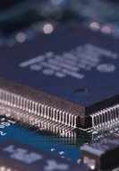

# Overview

David Kendall led the High Integrity Embedded Systems Group at Northumbria 
University in the 1990s. The group 
conduct research into formal methods in the engineering of embedded
systems, in particular the application of model-checking in the design
and analysis of real-time systems.

 
He is the main architect of CANDLE, a
modelling language and development environment for distributed
embedded systems built using the Controller Area Network (CAN). He was
previously involved in the AORTA project. He
is the author or co-author of a number of 
<a href="pubs.html">academic publications</a> (see his <a href="http://scholar.google.co.uk/citations?user=aKeklVAAAAAJ">Google
Scholar Profile</a>).

# Embedded Systems

Embedded control systems appear in many of the manufactured products
upon which our society increasingly depends, from household goods such
as washing machines and video recorders to advanced space vehicles or nuclear
power plant controllers. In every case, system developers need
better development methods in order to be more confident that the systems
which they deliver will behave properly. The need is particularly pressing
in the case of distributed, hard real-time control systems for industrial
sectors where reliability is paramount, such as transport, medical,
chemical and manufacturing.

My research is concerned with the theory and practice of embedded systems development
and analysis. In particular, I am interested in 
the key concepts and advanced practical techniques and tools required 
for the production of embedded systems solutions which are

<ul>
<li><em>high-integrity,</em></li> 
<li><em>real-time,</em></li> 
<li><em>distributed,</em> and</li> 
<li><em>open.</em></li> 
</ul>

# Projects

## CANDLE

The project is concerned in particular with the Controller Area
Network (CAN) protocol which is a <em>de facto</em> standard
in the automotive industry.  An abstract formal model of CAN is
developed. This model is adopted as the communication primitive in a
new language, <em>bCandle</em>, which includes value passing, broadcast
communication, message priorities and explicit time.  A high-level
language, <em>candle</em>, is introduced and its semantics defined by
translation to <em>bCandle</em>. We show how realistic CAN systems can be
described in <em>candle</em> and how a timed transition model of a system can
be extracted for analysis. Most importantly, it is shown how efficient methods
of analysis, such as `on-the-fly' and symbolic techniques, can be
applied to these models.

<strong>See also</strong> The CANDLE project has its 
<a href="http://www.inrialpes.fr/vasy/cadp/software/01-b-candle.html">own page</a> on the VASY site at INRIA.

## AORTA

 
The AORTA project was concerned with the development of a formal
language for the development of small, multi-tasking embedded systems
implemented on uni-processors, employing a simple scheduling
algorithm. It was one of the first projects ever to
consider both the implementation and verification of asynchronous,
hard real-time systems.

# Research students
<ul>
<li>Neil Eliot <em>Energy-efficient swarming protocols for UAVs</em>, 2017</li>
<li>Stephen Doswell <em>Anonymity and mobility in IP networks</em>, 2015</li>
<li>Ali Almohammad <em>Rigorous code generation for distributed embedded systems</em>, 2012 </li>
<li>Michael Brockway, <em>Compositionality in the formal modelling and analysis of broadcasting embedded control systems</em>, 2010</li>
<li>Kashif Saghar, <em>Formal modelling and analysis of denial of service attacks in wireless sensor networks</em>, 2010</li>
<li>Stephen Bradley, <em>An implementable formal language for real-time systems</em>, 1995</li>
<li>David Turner, <em>Predictable communication protocols for real-time systems</em>, 1995</li>
</ul>
