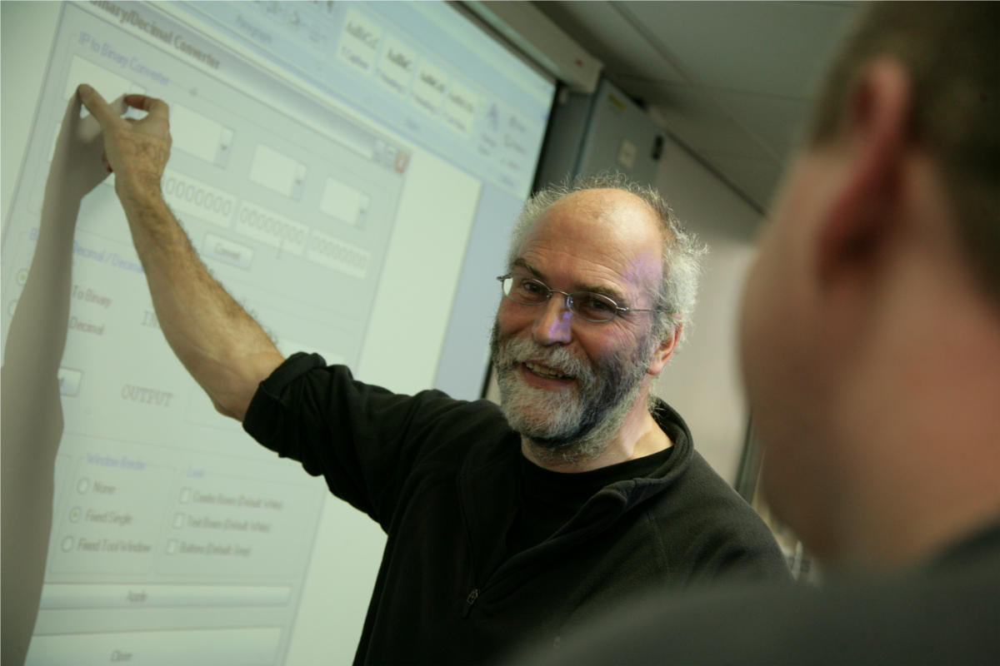

# Courses

I teach courses in formal methods, embedded systems, operating systems and
networking.  Previously, I have taught courses in programming, software
engineering, and compiler construction. Here is a (partial) list of my 
current courses:

  

<ul>
  <li><a href="{{ url }}{{ baseurl }}kf5010">KF5010 Operating Systems and Concurrency</a></li>
  <li><a href="{{ url }}{{ baseurl }}kf5010">KV5002 Computer networks, security and operating systems</a></li>
  <li><a href="{{ url}}{{ baseurl}}kf6009">KF6009 Model-based design and verification</a></li>
  <li><a href="{{ url}}{{ baseurl }}kf6010">KF6010 Distributed real-time systems</a></li>
  <li><a href="{{ url }}{{ baseurl }}kf7046">KF7046 Computer Network Implementation</a></li>
</ul>

# Projects

I am available to supervise both BSc and MSc projects. I
am happy to discuss any project ideas in the areas of my current, or
previous, courses.  Preferably, I will supervise students who wish to
choose one of the projects from my list
of <a href="projects.html">BSc and MSc Projects</a>.

# Computer Science and Engineering

I am a member of the Department of Computer Science in the Faculty of
Engineering and Environment and most of my
teaching is concerned with Computer Science and Computer Engineering. 
The ACM provide [curricula recommendations](https://www.acm.org/education/curricula-recommendations) in these areas.

# Academic Links

Key dates for the academic year at Northumbria University are available in
the 
<a href="https://www.northumbria.ac.uk/about-us/university-services/academic-registry/registry-records-and-returns/academic-calendars/">Academic Calendar</a>

There are documents relating to <a href="https://www.northumbria.ac.uk/about-us/university-services/academic-registry/quality-and-teaching-excellence/assessment/guidance-for-students/">University regulations on assessment of taught programmes</a>
